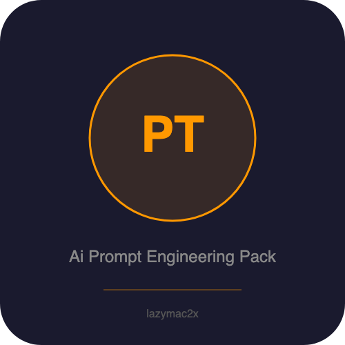

<p align="center"></p>

# AI Prompt Engineering Pack v1.0.0

**70 battle-tested, premium prompts for Claude, ChatGPT, Gemini, and any LLM.**

Stop writing mediocre one-liner prompts. This pack gives you detailed, structured prompts that produce professional-grade output every time.

---

## What's Inside

| Pack | Prompts | For |
|------|---------|-----|
| **Developer** | 20 prompts | Code review, architecture, DevOps, testing, security, databases |
| **Digital Marketer** | 20 prompts | SEO, ads, email campaigns, landing pages, analytics, brand strategy |
| **Student & Learner** | 15 prompts | Research, essays, study plans, exam prep, language learning |
| **AI Automation** | 15 prompts | Data pipelines, scraping, monitoring, report generation, workflows |

**Total: 70 prompts across 4 packs.**

---

## Why This Pack Is Different

- **Not one-liners.** Each prompt is 5-15 lines with detailed instructions, output format specifications, and edge case handling.
- **Placeholder variables.** Every prompt uses `{placeholder}` syntax so you can quickly customize for your specific use case.
- **Works with any AI.** Tested with Claude, ChatGPT (GPT-4), Gemini, and open-source models. These prompts are model-agnostic.
- **Real-world tested.** Every prompt has been used in production settings — not theoretical examples.

---

## How to Use

### Step 1: Choose Your Prompt
Browse the pack that matches your role. Each prompt has a clear title and description.

### Step 2: Fill in the Placeholders
Replace every `{placeholder}` with your specific context. The more detail you provide, the better the AI output.

**Example:**
```
Before: Help me write a {essay_type} essay on {topic}...
After:  Help me write an argumentative essay on the impact of remote work on urban economies...
```

### Step 3: Paste into Your AI Tool
Copy the completed prompt into Claude, ChatGPT, or any LLM. Send it as a single message.

### Step 4: Iterate
Use the AI's output as a strong first draft. Refine with follow-up messages as needed.

---

## Pro Tips

1. **Be specific with placeholders.** "{describe your product}" works better as "B2B SaaS project management tool for teams of 10-50, priced at $29/month, competing with Asana and Monday.com"

2. **Chain prompts together.** Use the output of one prompt as input for another. Example: Use the SEO Content Cluster Strategy prompt, then feed each topic into the SEO Blog Article Generator.

3. **Save your customized versions.** Once you've filled in a prompt for your specific use case, save it. You'll reuse it often.

4. **Use system prompts.** If your AI tool supports system prompts (Claude API, ChatGPT custom instructions), paste the prompt there for consistent results across conversations.

5. **Combine packs.** A developer launching a side project can use Developer prompts for the code AND Marketer prompts for the launch.

---

## File Structure

```
ai-prompt-engineering-pack/
  prompts/
    developer.md      — 20 developer prompts
    marketer.md       — 20 digital marketer prompts
    student.md        — 15 student & learner prompts
    automation.md     — 15 AI automation prompts
  README.md           — This file
  CHANGELOG.md        — Version history
```

---

## Who Made This

Built by someone who uses AI tools every day for real work — not as a novelty. These prompts represent hundreds of hours of iteration and refinement.

---

## License

This is a commercial product. You may use these prompts for personal and commercial projects. You may not redistribute, resell, or share the prompts themselves.

---

*Thank you for your purchase. If this pack saves you even one hour of work, it's already paid for itself.*
